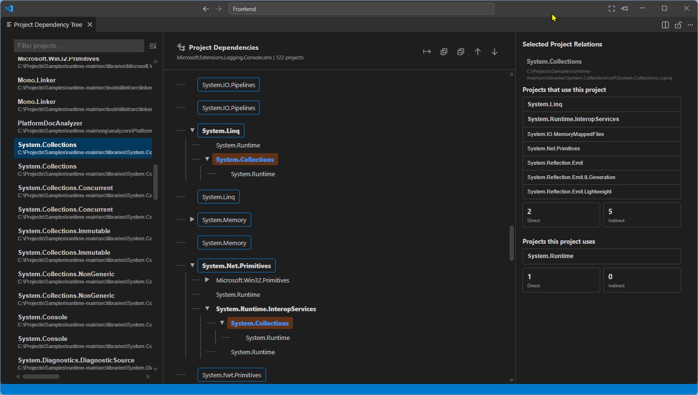

# Project Dependency Tree

> Explore complete .NET project-to-project dependencies from a Visual Studio Solution as a clean, recursive tree.



## Overview

**Project Dependency Tree** is a Visual Studio Code extension for understanding project-to-project dependencies across an entire `.sln` or `.slnx` solution.

It focuses only on project dependencies. It does not turn the solution into a file, folder, class, namespace, or package graph.

### Highlights

- Supports `.sln` and `.slnx` solutions.
- Discovers projects across nested `.slnx` folders.
- Builds a recursive dependency tree from `ProjectReference` relationships.
- Shows all solution projects in a searchable project list.
- Highlights a selected project and its upstream dependents.
- Shows direct and indirect relations for the selected project.
- Supports expand/collapse, previous/next occurrence navigation, and cycle detection.
- Works with project types such as `.csproj`, `.fsproj`, `.vbproj`, and `.sqlproj`.
- Exports the complete dependency tree to a TXT file.
- Requires no additional VS Code extension or third-party runtime dependency.

## Supported dependency model

The extension uses `ProjectReference` entries as the dependency source.

```text
Web.Api
└── Application
    └── Domain
```

In this example, `Application` is a direct dependency of `Web.Api`, while `Domain` is an indirect dependency.

Only projects declared by the selected Solution are included in the dependency model. References to projects outside that Solution are not added to the tree.

## Export

Use **Export TXT** in the dependency-tree header to save the current tree as a UTF-8 text file.

The extension opens the standard Save dialog and suggests a filename based on the selected Solution.

## Installation

### From the Marketplace

Search for **Project Dependency Tree** in the VS Code Extensions view and select **Install**.

### From a VSIX

For local installation:

```powershell
code --install-extension project-dependency-tree-0.15.0.vsix
```

## Usage

1. Open the Command Palette with `Ctrl+Shift+P`.
2. Run **Project Dependency Tree: Open**.
3. Select a `.sln` or `.slnx` file.
4. Select a project from the project list or dependency tree.
5. Explore its dependency relationships.

## Commands

| Command | Description |
|---|---|
| `Project Dependency Tree: Open` | Select a Solution and open the dependency view. |
| `Project Dependency Tree: Export Tree to Text` | Export the dependency tree to a TXT file. |

## Requirements

- Visual Studio Code `1.90.0` or later.
- A `.sln` or `.slnx` solution containing the projects you want to inspect.

## Privacy

The extension reads the selected Solution and project files locally to build the dependency model. It does not send project contents to a remote service.

## Support

Report bugs and request features through the project's GitHub repository:

https://github.com/CleanEngineering/ProjectDependencyTree_VSCode_Extension/issues

## Development

The extension is implemented with the VS Code Extension API, Webview HTML/CSS/JavaScript, and bundled Codicon assets. It has no runtime dependency on a third-party tree or graph library.

To package locally:

```powershell
npm install -g @vscode/vsce
vsce package
```

## License

MIT. See [LICENSE](LICENSE).

## Publisher

Created and published by **CleanEngineering**.

Repository: https://github.com/CleanEngineering/ProjectDependencyTree_VSCode_Extension

## Support

If this extension is useful to you, consider supporting its development:

- ☕ [Buy Me a Coffee](https://buymeacoffee.com/cleanengineering)
- ❤️ [GitHub Sponsors](https://github.com/sponsors/CleanEngineering)

Your support helps me continue building and maintaining free, open-source tools for developers.
